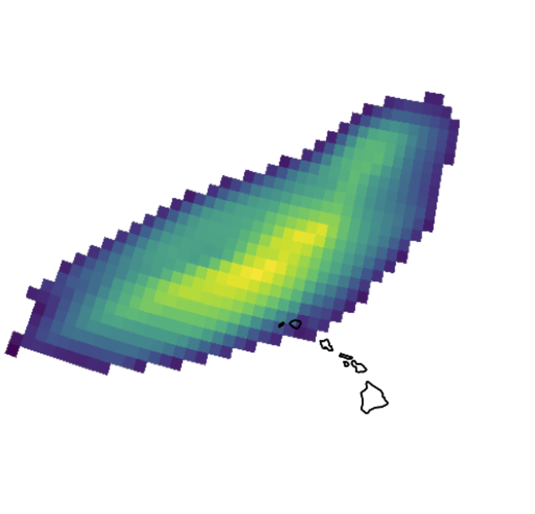

# Prototype Cookbook



[](https://github.com/ProjectPythia/cookbook-template/actions/workflows/nightly-build.yaml)
[](https://binder.projectpythia.org/v2/gh/ProjectPythia/cookbook-template/main?labpath=notebooks)
[](https://zenodo.org/badge/latestdoi/475509405)

This Project Pythia Cookbook covers working with the [**PIKART**](https://ar.pik-potsdam.de/?a=general) dataset to interpret and plot atmospheric rivers globally.

## Motivation

This Prototype Cookbook was created for ATM433/533 as a prototype of the final project, which will also cover atmospheric river visualization with the [**PIKART**](https://ar.pik-potsdam.de/?a=general) dataset. This prototype cookbook functions as my submission for homework 3.

## Authors

[Jesse Hoogs](https://github.com/JesseH44)

### Contributors

<a href="https://github.com/JesseH44/proto-cookbook/graphs/contributors">
  
</a>

## Structure

This project contains two primary notebooks which should be viewed in the order: data_access.ipynb -> visualization.ipynb, as well as a conclusion.

### Section 1: Data Access

This notebook acts as a foundational notebook for interacting and understanding the [**PIKART**](https://ar.pik-potsdam.de/?a=general) dataset. Content covered includes accessing the data through the cloud via a url and the THREDDS server as well as the dataset format and content.

### Section 2: Visualization

This notebook expands on the data access notebook as an example workflow of visualizing the dataset. Focuses on a specific atmospheric river event and demonstrates both static and dynamic visualization.

## Running the Notebooks

You can either run the notebook using [Binder](https://binder.projectpythia.org/) or on your local machine.

### Running on Binder

The simplest way to interact with a Jupyter Notebook is through
[Binder](https://binder.projectpythia.org/), which enables the execution of a
[Jupyter Book](https://jupyterbook.org) in the cloud. The details of how this works are not
important for now. All you need to know is how to launch a Pythia
Cookbooks chapter via Binder. Simply navigate your mouse to
the top right corner of the book chapter you are viewing and click
on the rocket ship icon, (see figure below), and be sure to select
“launch Binder”. After a moment you should be presented with a
notebook that you can interact with. I.e. you’ll be able to execute
and even change the example programs. You’ll see that the code cells
have no output at first, until you execute them by pressing
{kbd}`Shift`\+{kbd}`Enter`. Complete details on how to interact with
a live Jupyter notebook are described in [Getting Started with
Jupyter](https://foundations.projectpythia.org/foundations/getting-started-jupyter).

Note, not all Cookbook chapters are executable. If you do not see
the rocket ship icon, such as on this page, you are not viewing an
executable book chapter.


### Running on Your Own Machine

If you are interested in running this material locally on your computer, you will need to follow this workflow:

1. Clone the `https://github.com/JesseH44/proto-cookbook` repository:

   ```bash
    git clone git@github.com/JesseH44/proto-cookbook
   ```

1. Move into the `cookbook-example` directory
   ```bash
   cd proto-cookbook
   ```
1. Create and activate your conda environment from the `environment.yml` file
   ```bash
   conda env create -f environment.yml
   conda activate proto-cookbook
   ```
1. Move into the `notebooks` directory and start up Jupyterlab
   ```bash
   cd notebooks/
   jupyter lab
   ```
